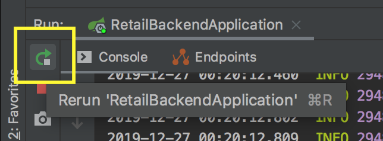

# Explore the Project

## Goal

Add a simple `/health` endpoint to your application

## Implementation Details

If you are like me, I learn through doing.  Although I learn quite a bit from reading articles and videos, ultimately I learn from doing.  Academics only get you so far :D 

So lets fire up the code exactly as is and see what happens. 

1. Open the IntelliJ IDE that we installed a few steps back. 

2. On the splash screen click the `Open` button

3. In the Open Dialog, naviagate to the folder that we exploded in the previous step. 

4. Click "Open".  This will import the project and run the gradle setup. 

## Running

You have two options for running.  The serve different purposes, so I'll show you both

### Option 1: Terminal 

1. Open the built in terminal in IntelliJ.

2. In the terminal type `./gradlew clean bootRun`

3. You will see the output of the startup. 

```
<trim> Tomcat started on port(s): 8080 (http) with context path ''
<trim> Started RetailBackendApplication in 2.874 seconds (JVM running for 3.385)
```

4. To Stop, Press control-c

### Option 2: In IntelliJ 

Because SpringBoot apps have a `main()` then IntelliJ can find it and execute it auto-magically. 

1. Click on the `Run --> Run 'RetailBackendApplication'`

2. You will now see similar output from the terminal in a tab called `console`

```
<trim> Tomcat started on port(s): 8080 (http) with context path ''
<trim> Started RetailBackendApplication in 2.874 seconds (JVM running for 3.385)
```

3. To stop, you can click `Run --> Stop 'RetailBackendApplication'` or click the red stop square on the debug window. 

Why use this method instead of via `gradlew`? Because this gives you access to the step through debugger.  Just click `Run --> Debug 'RetailBackendApplication'` Set a break point and you can walk all your code. 

### Is the app alive? 

If you open your browser to http://localhost:8080 (you can veify that in the console/terminal output) you should see a simple error message:

```
Whitelabel Error Page
This application has no explicit mapping for /error, so you are seeing this as a fallback.

Fri Dec 27 00:05:17 EST 2019
There was an unexpected error (type=Not Found, status=404).
No message available
```

This is a success.  You hit the Servlet engine which basially said, `I have no clue what todo`. and gave you back an error.  Whoo hoo! 


## GET /health

At this point, you could be familar with the concept of MVC, but if not, let me give you the elevator pitch:

MVC stands for [Model, View, and Controller](https://en.wikipedia.org/wiki/Model%E2%80%93view%E2%80%93controller).  It is one of the longest lasting architecture patterns, having been introduced in the late 1970s, and is still powerful today. 

* Model - The representation of the data. User class, Product class, etc
* View - How the Model (data) will be manipulated to show the user. The "View" is less important on the server side, depending on the pattern being implemented. 
* Controller - Is the "brains" of the operation.  It is the Air Traffic Controller. It reacts to the inputs and uses the models and the views to process and prepare the data. 

Lets add a simple `/health` controller.  

1. Open the Project tab on the left so you see all the files. 
2. Expand out `src/main/java/com.houseawesome.RetailBackend`
3. Right Click on `com.houseawesome.RetailBackend` 
4. Select `New --> Package`
5. Enter `controllers`
6. Right click on `com.houseawesome.RetailBackend.controllers`
4. Select `New --> Java Class`
5. For the name: `HealthController`
6. Open the file and replace all the contents with this:

```
package com.houseawesome.RetailBackend.controllers;

import org.springframework.web.bind.annotation.RequestMapping;
import org.springframework.web.bind.annotation.RequestMethod;
import org.springframework.web.bind.annotation.RestController;

@RestController
public class HealthController {

    @RequestMapping(value = "/health", method = RequestMethod.GET)
    public String health() {
        // imagine the code checking a few things like the database
        // then returning "ok" or "error"
        return "ok";
    }
}
```
7. Restart the application by clicking the "Rerun" button on the debug left. Or just clicking `Run --> Run 'RetailBackendApplication'`



8. Now in a seperate terminal (or postman or browser) issue a `GET http://localhost:8080/health`

```
curl -v http://localhost:8080/health; echo
*   Trying ::1...
* TCP_NODELAY set
* Connected to localhost (::1) port 8080 (#0)
> GET /health HTTP/1.1
> Host: localhost:8080
> User-Agent: curl/7.54.0
> Accept: */*
> 
< HTTP/1.1 200 
< Content-Type: text/plain;charset=UTF-8
< Content-Length: 2
< Date: Fri, 27 Dec 2019 05:27:13 GMT
< 
* Connection #0 to host localhost left intact
ok <--------------------------- WHOO HOOO!!!
```
## Further Reading and Research

* https://spring.io/guides/gs/rest-service/
* https://spring.io/guides/gs/relational-data-access/


## [NEXT -->](12-layers-and-layers.md)